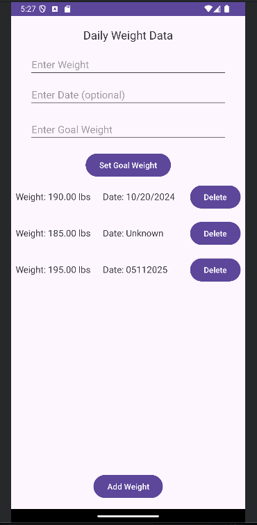

ePortfolio

# NuMe Project


### Code Review and planned enhancement for the NuMe Application
<iframe width="560" height="315" src="https://www.youtube.com/embed/njhcB8VI0jM?si=W7s5Q8Ngxx2LQSpw" title="YouTube video player" frameborder="0" allow="accelerometer; autoplay; clipboard-write; encrypted-media; gyroscope; picture-in-picture; web-share" referrerpolicy="strict-origin-when-cross-origin" allowfullscreen></iframe>
<br>

# Enhancement One: Software design and engineering

Implement real-time goal validation feedback when the user enters a goal weight (implemented with TextWatcher in Java). This feature displays messages dynamically based on comparisons to the latest logged weight, making the app more user-friendly and ensuring a better user experience.

### Pseudocode: 
```
If (goalWeight < lowestTrackedWeight)
   Display "Aggressive goal"
Else if (goalWeight == currentWeight)
   Display "Already at goal"
Else
   Display "Goal saved!"
```

## Goal Weight Input

Users can set a goal weight in the app. As they type, the app provides real-time feedback on whether their goal is **aggressive**, **moderate**, or **above their current weight**.

This feature is implemented using a `TextWatcher` on the input field:

```java
// Simplified example of how the goal weight input is handled
mGoalWeightInput.addTextChangedListener(new TextWatcher() {
    @Override
    public void afterTextChanged(Editable s) {
        // Logic to compare goal weight with current weight and display feedback
        // ... (details are in the source file)
    }
    // other TextWatcher methods omitted for brevity
});
```
### Pull Request:
Check out the TextWatcher Pull Request 2: [TextWatcher](https://github.com/rramoscode/rramoscode.github.io/pull/2/files).

### Narrative:
The [Enhancement One Narrative](docs/Enhancement One_Narrative.pdf) provides additional details about Enhancement One for the NuMe Project. Specifically: 
* Briefly describe the NuMe App.
* Justify the inclusion of the NuMe App in this ePortfolio.
* Reflect on the process of enhancing the NuMe App.


# Enhancement Two: Algorithms and data structures

Implement a weekly average weight change algorithm. Used a filtered list of entries from the last 7 days. Results are displayed as a message. This enhancement introduces basic data processing using algorithmic principles and data filtering.

### Pseudocode: 
```
Get currentDate
For all weights in past 7 days:
    sum += weight
avg = sum / numberOfDays
Display currentWeight - avg
```

## Weekly Weight Change Calculation

The app provides users with a clear summary of their **weekly weight change**. This feature calculates the difference between the user's current weight and their average weight over the past seven days, offering quick insight into their progress.

This is handled by querying the local database for historical weight entries:

```java
// Simplified example of how weekly change is calculated
private void calculateWeeklyChange(double currentWeight) {
    // Logic to retrieve past 7 days of weight data and calculate average
    // ... (details are in the source file)
}
```
### Pull Request:
Check out calculateWeeklyChange Pull Request 3: [calculate Weekly Change](https://github.com/rramoscode/rramoscode.github.io/pull/3).


### Narrative:
The [Enhancement Two Narrative](docs/Enhancement Two_Narrative.pdf) provides additional details about Enhancement Two for the NuMe Project. Specifically. 
* Briefly describe the NuMe App.
* Justify the inclusion of the NuMe App in this ePortfolio.
* Reflect on the process of enhancing the NuMe App.


# Enhancement Three: Database

Implemented a new ‘goal_history’ table to track every time a goal is set and when it is achieved. Display a historical list of goal attempts and outcomes.

## Table Structure: 
```
CREATE TABLE goal_history (
    id INTEGER PRIMARY KEY AUTOINCREMENT,
    goal_weight REAL,
    set_date TEXT,
    achieved_date TEXT
);
```
### Goal History Table

The application's database has been enhanced to provide more robust user data management and tracking capabilities. This includes dedicated tables for user accounts, daily weight logs, and goal weights. A new goal_history table was added to specifically track user goals, logging each new goal set and marking when it's achieved.

This new structure is implemented in the DatabaseHelper.java file:

```java
// Simplified onCreate method showing table creation
public void onCreate(SQLiteDatabase db) {
    // ... (details are in the source file)
}

// Simplified onUpgrade method for database schema changes
public void onUpgrade(SQLiteDatabase db, int oldVersion, int newVersion) {
    // ... (details are in the source file)
}
```

## Goal Achievement Tracking

As part of the database enhancements, the application now actively tracks when a user achieves their set weight goal. When a user reaches their goal, the achievement date is recorded in the goal_history table, providing a valuable historical record of their progress.

This is managed by a dedicated method in DataDisplayActivity.java:

```java
// Method to update the achievement date when a goal is met
private void updateGoalAchievementDate() {
    // ... (details are in the source file)
}
```
### Pull Request:
Check out goal_history Pull Request 4: [Goal History](https://github.com/rramoscode/rramoscode.github.io/pull/4).

### Narrative:
The [Enhancement Three Narrative](docs/Enhancement Three_Narrative.pdf) provides additional details about Enhancement Three for the NuMe Project. Specifically. 
* Briefly describe the NuMe App.
* Justify the inclusion of the NuMe App in this ePortfolio.
* Reflect on the process of enhancing the NuMe App.


# NuMe Application before enhancements:

<table>
  <tr>
    <td valign="top">
      
    </td>
    <td valign="top">
      <h3>Enhancement One:</h3>

      <ul>
        <li>No real-time feedback when setting a goal weight.</li>
        <li>Users have to guess if their goal is aggressive or realistic.</li>
        <li>No clear prompts for the goal weight input field.</li>
        <li>Date formatting or no date input</li>
      </ul>

      <h3>Enhancement Two:</h3>
      <ul>
        <li>No analytical insights are provided to the user.</li>
        <li>Users cannot see trends, such as their weekly weight change.</li>
        <li>Results not displayed.</li>
      </ul>

      <h3>Enhancement Three:</h3>
      <ul>
        <li>No historical tracking of goals exists.</li>
        <li>Old goals are lost. When changing the goal weight</li>
        <li>No logging exists for user goal attempts</li>
        <li>No indicators when goals are reached.</li>
      </ul>
      
   </td>
  </tr>
</table>

# NuMe Application after enhancements: 


